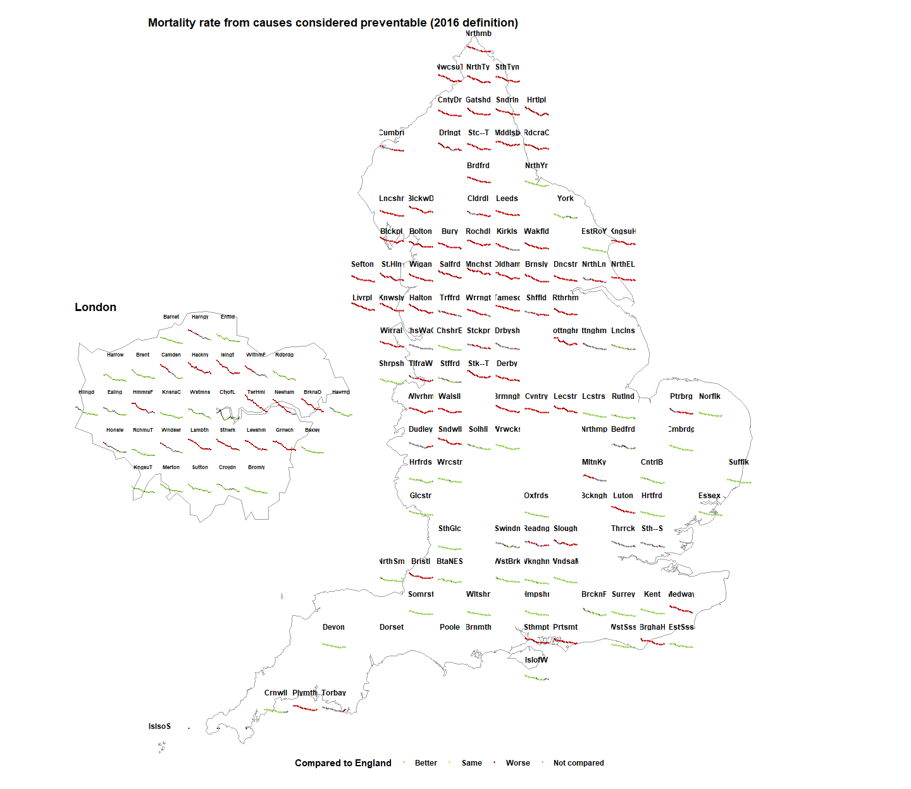

<!-- README.md is generated from README.Rmd. Please edit that file -->

# EnglandFacets

<!-- badges: start -->

[](https://github.com/sebastian-fox/EnglandFacets/actions)
[](https://github.com/sebastian-fox/EnglandFacets/actions)
<!-- badges: end -->

The goal of EnglandFacets is to provide grids and sf files to allow
users to plot faceted charts onto a map of England and London.

## Installation

You can install the development version of EnglandFacets from
[GitHub](https://github.com/) with:

``` r
# install.packages("devtools")
devtools::install_github("sebastian-fox/EnglandFacets")
```

## Example

This is a basic example which shows you how to solve a common problem:

``` r
library(EnglandFacets)

grid_london <- EnglandFacets::london_grid
grid_no_london <- EnglandFacets::outside_london_grid

df <- fingertipsR::fingertips_data(
        IndicatorID = 92488,
        AreaTypeID = 402
)

df <- df |> 
        dplyr::rename(
                name = AreaName, 
                code = AreaCode) |> 
        dplyr::mutate(
                name = abbreviate(name, 6))

shp_eng <- EnglandFacets::england_shp

shp_lond <- EnglandFacets::london_shp


england_data <- df |> 
        dplyr::filter(code %in% grid_no_london$code,
                      AreaType == "Counties & UAs (from Apr 2021)",
                      Sex == "Persons")
london_data <- df |> 
        dplyr::filter(code %in% grid_london$code,
                      AreaType == "Counties & UAs (from Apr 2021)",
                      Sex == "Persons")
```

``` r
EnglandFacets::utla_plot(
        london_data = london_data,
        england_data = england_data,
        london_grid = grid_london,
        england_grid = grid_no_london)
```


